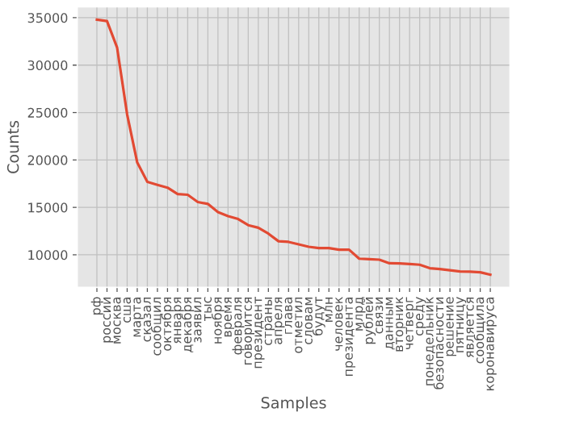

# Tass-Data-Processing

Processing the data from "TASS" (Russian News Agency). The links: https://tass.ru/ and https://tass.com/.

This repo contains extracted public data, supplemented by processing of article texts (from the beginning of October 2019 to mid-April 2020). This project shows how to extract, load, transform, analyze and visualize information from the "TASS".

# Headers

[Short Introduction](#Introduction)

[Power BI](#Power_BI)

[Plotly Visualizations](#Plotly)

[What are the parts of this repo?](#What_are_the_parts_of_this_repo)

[What is the reason for this research?](#What_is_the_reason_for_this_research)


<a name="Introduction"></a>

# Short Introduction

Visualizations are presented as images and gifs of Python data processing alongside with PowerBI demos.

By the beginning of May (2020) many countries were under a lockdown so, one way or another, mostly everyone was aware of COVID-19 and a lot of areas(categories) of everyday life were affected. So, I chose a half-year interval that ends by May. 

The timeline: there is a selection of days from the beginning of October 2019 to mid-April 2020. Each and every day consists of a different number of articles. Articles have different feature columns (e.g. title; article_text; category; etc.)

There are about 11.5k COVID-19 related articles out of all (68k) articles.

I have placed the results at the beginning to make it more interesting


<a name="Power_BI"></a>

## Power BI

There are colorful Power BI results


The very first article (related to COVID-19) is: 

https://tass.ru/obschestvo/7008288 (16th of October, 2019)

The next two articles (9th of January, 2020) start the wave

https://tass.ru/obschestvo/7484619

https://tass.ru/obschestvo/7487139

It seems like different categories were affected differently but there was a universal peak (16th of March, 2020)


Feel free to download this repository and check the files by Yourself for more information


<a name="Plotly"></a>

## Plotly Visualizations

These visual results can be opened right in a browser:

<h4>

```diff
! [NOTICE] 

Feel free to download these html files for a smooth experience

Unfortunately, it may take some time to load these heavy (35Mb) pages right in a browser. 

These files contain brief info about each article (about 70.000 articles),

So, it may take a while to react to Your actions (e.g. to zoom in, to show info about an article; etc.)

```

</h4>

Colorization by number of articles per day:
https://alexlx7.github.io/Tass-Data-Processing/output_images/full_info.html

COVID-19 related articles visualization:
https://alexlx7.github.io/Tass-Data-Processing/output_images/final_info.html


### Colorization by number of articles per day:


https://alexlx7.github.io/Tass-Data-Processing/output_images/full_info.html

Each day has its own color, depending on number of articles per day. Each cell contains a piece of information about one article.
As You can see from 'full_info.html': the days highlighted in blue are weekends and holidays, on such days there is much less news.


### COVID-19 related visualization:

There is the same selection of days. But the colors correspond to the field called 'covid_related'.
If the cell is indeed covid_related, the cell is highlighted in red:


https://alexlx7.github.io/Tass-Data-Processing/output_images/final_info.html

The 'final_info.html' file shows that COVID-19 has only been gaining attention in Russia since mid-January 2020:


By mid-March, COVID-19 related news exceeded half of all articles per day:


### Additional info:

The most common words from articles:



It is possible to make a Wordcloud by these common words. The size of each word corresponds to its frequency:


For more info check out 'analyzing.ipynb'.

<a name="What_are_the_parts_of_this_repo"></a>

# What are the parts of this data-processing repo?

### Web scraping:

Extracting.py contains ways to get info from the 'https://tass.ru/' (e.g. 'article_text', 'title', 'category', 'href') by the start date and the end date (e.g. ['2020-04-21 00:00:00', '2020-04-20 00:00:00']).
That parsed information is stored in '/data/' folder as .pickle file (per each month).

Feel free to download 'data/data_of_seven_months_without_article_texts.csv' to check the data by Yourself.

### ETL:

Cleaning.py contains ways to extract, transform and load important pieces of data to the dataframe.

### Analyzing and visualizing:

Analyzing.ipynb contains ways to show some basic info about the dataframe.
Visualizations are stored in '/output_images/' folder.

https://alexlx7.github.io/Tass-Data-Processing/output_images

### Power BI:

A file called 'tass_covid_related_report.pbix' contains insights which can be easilty opened by PowerBI Desktop Application.

https://alexlx7.github.io/Tass-Data-Processing/tass_covid_related_report.pbix

<a name="What_is_the_reason_for_this_research"></a>

# What is the reason for this research?

Initially, I was curious: when and how did the idea about this virus spread by different areas(categories) of our everyday life? Apart from that, I wanted to try a new at that time (April 2020) Jupyter Notebook in VS Code. So, I created this public repository and decided: 1) to check out old text articles to see how it all started; 2) to analyze articles about mentioning COVID-19; 3) to keep it structured (here, at github) so everyone could see the stages of processing and the results.


## Rate this project! :star:
### If you liked this repo, give it a star. Thanks!